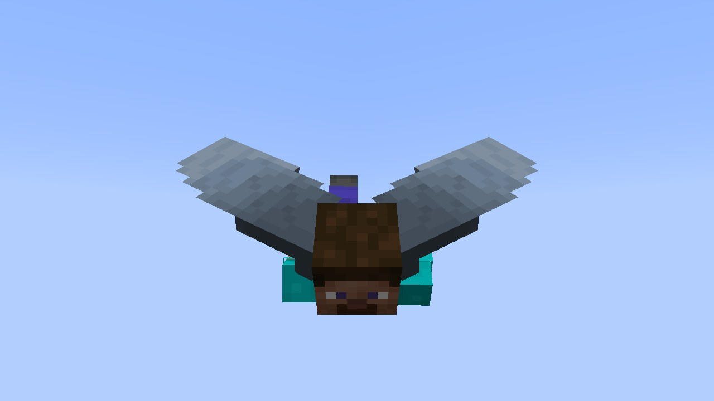
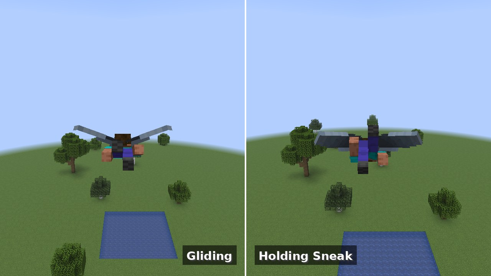
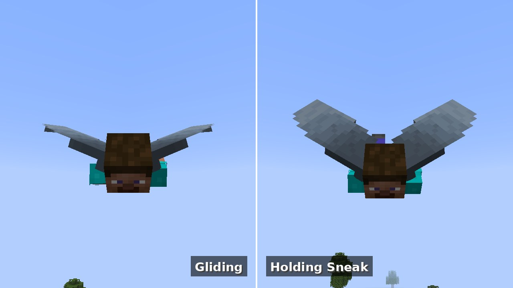
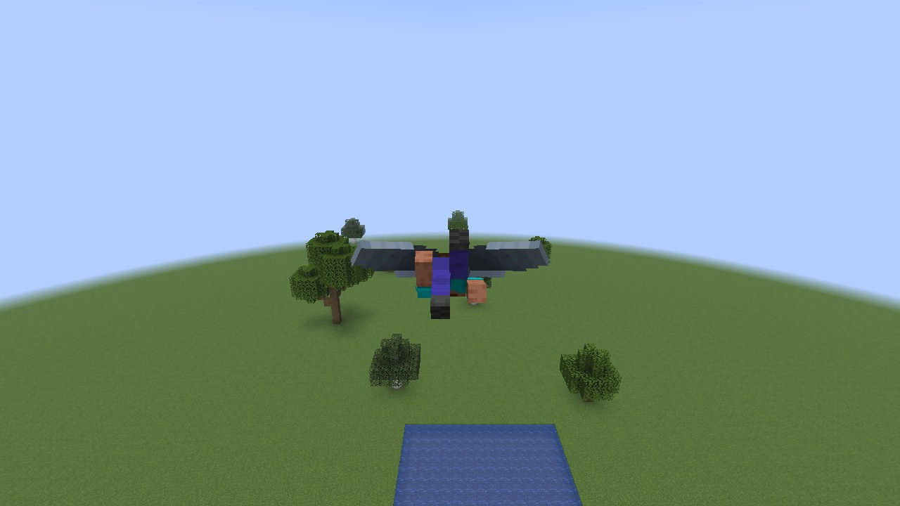

<p align="center"></p>

<h1 align="center">Elytra Drag</h1>

<p align="center">
  <b>Air brakes for your elytra: hold Sneak while flying to slow down.</b><br>
  <sub>Fabric 26.3 · braking works with the mod on the server alone · the wing animation comes with the client</sub>
</p>

<!-- badges:start -->
<p align="center">
  <a href="https://github.com/DarienRahl/Elytra-Drag/releases/latest"></a>
  
  
  <a href="LICENSE"></a>
</p>
<!-- badges:end -->

<p align="center">
  <br>
  <sub>Steve holding Sneak in flight: the elytra opens up and slows him down · taken in Minecraft 26.3 by CI</sub>
</p>

<p align="center">
  <a href="#quick-start"><b>Quick start</b></a> ·
  <a href="#what-you-get">Features</a> ·
  <a href="#gallery">Gallery</a> ·
  <a href="#installation">Installation</a> ·
  <a href="#configuration--configelytradragproperties">Configuration</a> ·
  <a href="#how-it-works">How it works</a> ·
  <a href="#faq">FAQ</a>
</p>

An elytra is fast to fly and hard to stop. Elytra Drag adds the brakes: hold **Sneak** while flying and you slow
down, your firework boost burns out, and a braked landing hurts much less. Let go and you glide on as usual.

## What you get

<table>
<tr>
<td width="33%" valign="top">

### 🪂 Air brakes
Hold Sneak in flight and every tick you lose speed — 10 % a tick with the default drag — until you let go.

</td>
<td width="33%" valign="top">

### 🎆 Rockets stop
An active firework boost ends as soon as you start braking, so you never fight your own rocket.

</td>
<td width="33%" valign="top">

### 🦴 Softer landings
While you brake, the fall distance is capped and reset once you sink slowly, so a braked landing does little or
no damage.

</td>
</tr>
<tr>
<td valign="top">

### 🪽 Wings that show it
With the mod on your client, the elytra of every player who brakes opens up: spread and flapping when slow,
swept back when fast.

</td>
<td valign="top">

### 🖥️ Works on the server
The braking runs on the server. Players join with a vanilla client and still brake; only the animation needs the
mod on the client.

</td>
<td valign="top">

### ⚙️ Configurable
Drag strength, the fall-distance cap and the minimum speed live in `config/elytradrag.properties`.

</td>
</tr>
</table>

## Gallery

<table>
<tr>
<td colspan="2"><br>
<sub><b>From behind</b> — gliding like in vanilla (left) and holding Sneak (right): the wings roll outwards and catch the air.</sub></td>
</tr>
<tr>
<td colspan="2"><br>
<sub><b>From the front</b> — the same flight, facing Steve.</sub></td>
</tr>
<tr>
<td colspan="2"><br>
<sub><b>Braking</b> — slow enough to look around and pick a place to land.</sub></td>
</tr>
</table>

<sub>The pictures are made by CI in the real game: a Fabric client game test flies Steve over a flat world in
Minecraft 26.3 with this mod and takes the game's own screenshots (the <code>screenshots</code> workflow).</sub>

## Quick start

```text
1. Install Fabric Loader for Minecraft 26.3, put Fabric API and elytra-drag-<version>.jar into mods/.
2. Take off with an elytra.
3. Hold Sneak (Shift) to brake. Let go to glide on.
```

## Requirements

- Minecraft **26.3** with **Fabric Loader** ≥ 0.19.5,
- **Fabric API**,
- **Java 25**.

## Installation

1. Get `elytra-drag-<version>.jar`:
   - from the [**Releases**](https://github.com/DarienRahl/Elytra-Drag/releases/latest) page of this repository, or
   - from the **Actions** tab (the `Artifacts` of every build), or
   - build it yourself: `./gradlew build`. The jar ends up in `build/libs/`.
2. Put it into the `mods/` folder next to Fabric API — on the server, on the client, or both:

| Installed on | Braking | Rockets stop, softer landings | Wing animation |
|---|:---:|:---:|:---:|
| server only | ✅ | ✅ | — |
| client only (on a server without the mod) | — | — | ✅ |
| server and client, or single player | ✅ | ✅ | ✅ |

## Configuration – `config/elytradrag.properties`

The file is created with the defaults on the first start; changes apply after a restart.

```properties
#Elytra Drag Configuration
drag=2.0
maximum-fall-distance-while-slowing-Down=15.0
minimum-speed-required=0.1
```

| Key | Default | What it does |
|---|---|---|
| `drag` | `2.0` | How hard you brake. Every tick your speed is multiplied by 1 − 0.05 × drag: `2.0` keeps 90 % of it, `20` (the maximum) stops you at once, `0` turns braking off. |
| `maximum-fall-distance-while-slowing-Down` | `15.0` | While braking, the fall distance never goes above this many blocks. Fall damage starts after 3 blocks, so `15` means at most 12 damage before armor. |
| `minimum-speed-required` | `0.1` | Braking only kicks in above this speed, in blocks per second. |

Values out of range are clamped and invalid ones fall back to the default; the log says which.

## How it works

1. Every server tick the mod looks for players who fly with an elytra and hold Sneak. Their velocity is multiplied
   by 1 − 0.05 × `drag` and sent to their client, because a player's own client moves them.
2. While a player brakes, the fall distance is capped at `maximum-fall-distance-while-slowing-Down` and set back
   to 1 block whenever they sink slower than 1 block per tick, so a braked landing is gentle.
3. A firework rocket that boosts a braking player burns out on its next tick.
4. On a client with the mod, the elytra of every player who flies and holds Sneak is drawn open: the wings roll
   outwards, flap while slow and sweep back as the speed grows (fully swept at 45 blocks per second).

## Development

- Build with `./gradlew build` (Java 25). The jar ends up in `build/libs/`.
- New release: bump `mod_version` in `gradle.properties`, then run the **build** workflow by hand with **release**
  checked (Actions tab → build → Run workflow), run the **release** workflow, or push the tag `v<mod_version>`.
  The workflow builds the mod, creates the tag and publishes the release with the jar.
- **Pictures**: the `screenshots` workflow runs the client game test in `src/gametest` (`./gradlew runClientGameTest`)
  under a virtual display: Steve glides, then holds Sneak, and the game takes its screenshots from behind and from
  the front. `.github/scripts/readme_images.py` puts them together into `docs/images/screenshots`, and the workflow
  commits them. It runs when the test changes, or by hand from the Actions tab.
- The icon is original pixel art drawn by `.github/scripts/icon.py` (`python3 .github/scripts/icon.py`, needs
  Pillow).

## FAQ

<details>
<summary><b>Do players need to install anything?</b></summary>

Not for braking: with the mod on the server, players with a vanilla client brake too. The wing animation is drawn
by the client, so only players who have the mod see it.
</details>

<details>
<summary><b>Does it work in single player?</b></summary>

Yes, everything: single player runs its own server with the mod.
</details>

<details>
<summary><b>Can I still use firework rockets?</b></summary>

Yes. Only a rocket that boosts you while you hold Sneak burns out; let go and fire a new one.
</details>

<details>
<summary><b>Does braking stop all fall damage?</b></summary>

No, it limits it. While you brake the fall distance is capped (15 blocks by default, so at most 12 damage before
armor) and reset whenever you sink slowly, so a landing after braking usually does no damage. Diving into the ground
at full speed still hurts.
</details>

<details>
<summary><b>Why do other players' wings open on my screen?</b></summary>

Your client draws the animation for every player it sees flying and holding Sneak, whether they have the mod or not.
</details>

## License

MIT – see [LICENSE](LICENSE). The original mod is by [bl4st](https://github.com/bl4sterino/Elytra-Drag).
Minecraft is a trademark of Mojang/Microsoft. This mod is not affiliated with Mojang.
